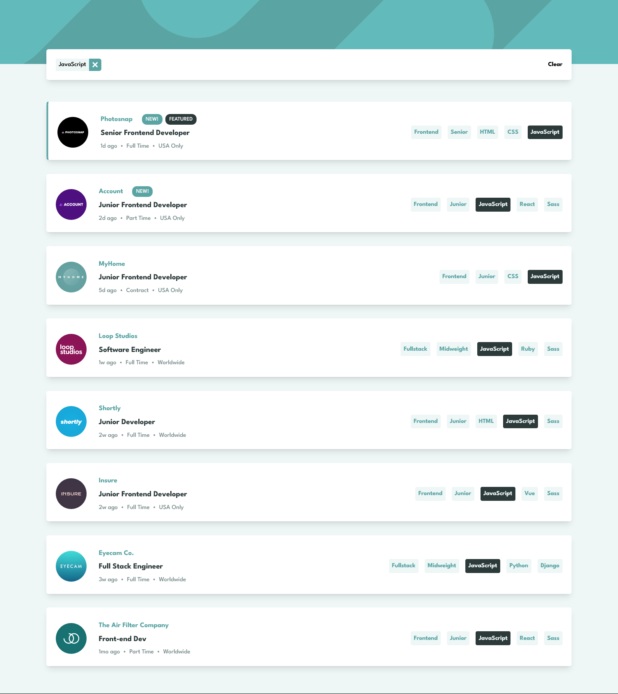

# Frontend Mentor - Job listings with filtering solution

This is a solution to the [Job listings with filtering challenge on Frontend Mentor](https://www.frontendmentor.io/challenges/job-listings-with-filtering-ivstIPCt). Frontend Mentor challenges help you improve your coding skills by building realistic projects.

## Table of contents

- [Frontend Mentor - Job listings with filtering solution](#frontend-mentor---job-listings-with-filtering-solution)
  - [Table of contents](#table-of-contents)
  - [Overview](#overview)
    - [The challenge](#the-challenge)
    - [Screenshot](#screenshot)
    - [Links](#links)
  - [My process](#my-process)
    - [Built with](#built-with)
    - [Continued development](#continued-development)
    - [Useful resources](#useful-resources)
  - [Author](#author)

## Overview

### The challenge

Users should be able to:

- View the optimal layout for the site depending on their device's screen size
- See hover states for all interactive elements on the page
- Filter job listings based on the categories

### Screenshot

### Links

- Solution URL: [To be added](https://your-solution-url.com)
- Live Site URL: [Deployed on Vercel](https://static-job-listings-ivory-nine.vercel.app/)

## My process

### Built with

- Semantic HTML5 markup
- Svelte [Transition + State Management API's]
- TypeScript
- WindiCSS [Flexbox + Grid]
- Mobile-first workflow
- Vite

### Continued development

Animations and Transitions are amazing for spycing things up a little. Guess I should learn more about them.

### Useful resources

- [Svelte Easing Functions Visualisation](https://svelte.dev/repl/6904f0306d6f4985b55f5f9673f762ef?version=3.4.1) - This Svelte REPL is insane for visualising how the built-in easing functions work and look like!
- [Svelte Docs on Transitions](https://svelte.dev/docs#run-time-svelte-transition) - Good to know

## Author

- Frontend Mentor - [@Shawn Lee](https://www.frontendmentor.io/profile/OGShawnLee)
